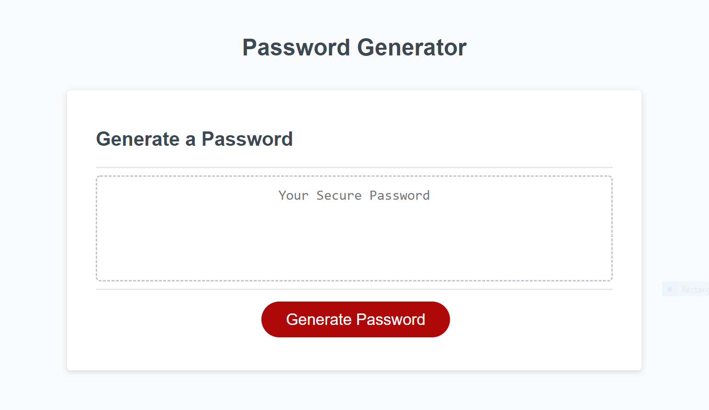
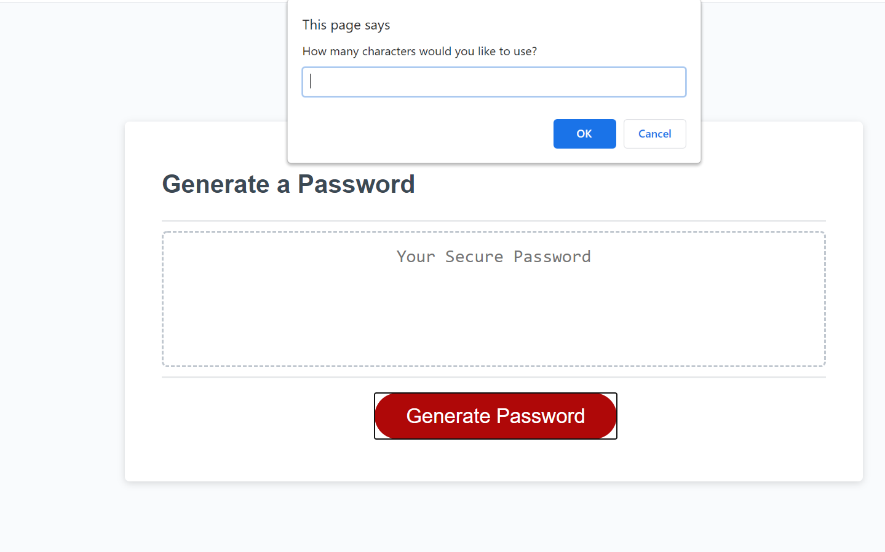
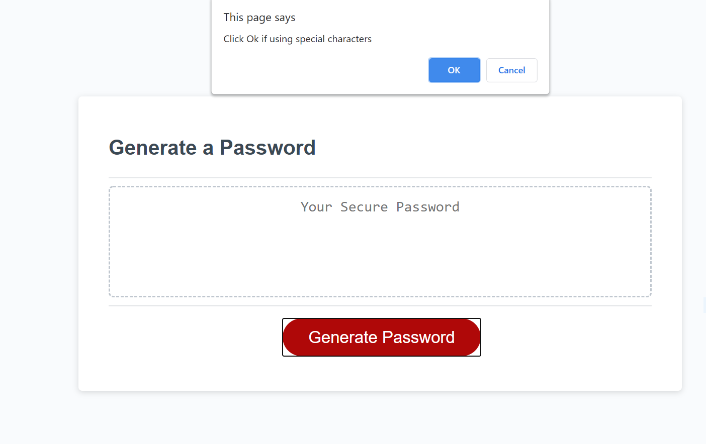
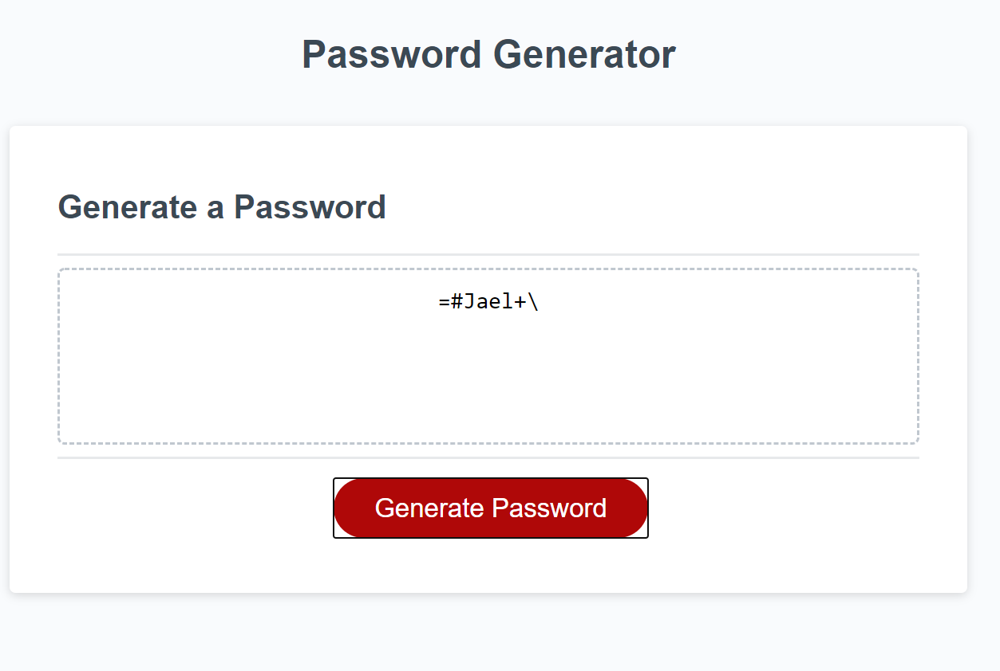

## 03 JavaScript: Password Generator

## Assignemnt

For the third homework assignment in week three of UNH Full-Stack Coding Bootcamp I was to modify starter code to create an application that enables employees to generate random passwords based on certain criteria that they’ve selected.

## The User Story

```
AS AN employee with access to sensitive data
I WANT to randomly generate a password that meets certain criteria
SO THAT I can create a strong password that provides greater security
```

## Description

This application generates a random password based on user-selected criteria when the generate password button is clicked on. When the button is clicked on, the user is asked a series of questions. The user is first prompted to enter a number for how many characters they would like to use in their password. If the user enters a letter or symbol in place of a number, they are alerted to enter a valid number. If the use enters any number less than 8 or more than 128, they recieve an alert message to enter a number between 8 and 128. Next, the user is prompted to click Ok is using numbers, special characters, upper case letters, or lower case letters in their password. If they user click cancel for each criteria, the are alerted they need to choose at least one character type. Once all prompts are answered and verified, the user will be presented with a password matching what they chose in the prompts. 

## Built with

* HTML
* CSS
* JavaScript

## Links

* [GitHub Repository](https://github.com/efagioli01/Password-Generator-code-refactor)
* [Deployed Application](https://efagioli01.github.io/Password-Generator-code-refactor/)


## Screenshot 
 
 
 
 
 
 
 ## LICENSE

 MIT License

Copyright (c) [2021] [Erica Fagioli] 

Permission is hereby granted, free of charge, to any person obtaining a copy of this software and associated documentation files (the "Software"), to deal in the Software without restriction, including without limitation the rights to use, copy, modify, merge, publish, distribute, sublicense, and/or sell copies of the Software, and to permit persons to whom the Software is furnished to do so, subject to the following conditions:

The above copyright notice and this permission notice shall be included in all copies or substantial portions of the Software.

THE SOFTWARE IS PROVIDED "AS IS", WITHOUT WARRANTY OF ANY KIND, EXPRESS OR IMPLIED, INCLUDING BUT NOT LIMITED TO THE WARRANTIES OF MERCHANTABILITY, FITNESS FOR A PARTICULAR PURPOSE AND NONINFRINGEMENT. IN NO EVENT SHALL THE AUTHORS OR COPYRIGHT HOLDERS BE LIABLE FOR ANY CLAIM, DAMAGES OR OTHER LIABILITY, WHETHER IN AN ACTION OF CONTRACT, TORT OR OTHERWISE, ARISING FROM, OUT OF OR IN CONNECTION WITH THE SOFTWARE OR THE USE OR OTHER DEALINGS IN THE SOFTWARE.

